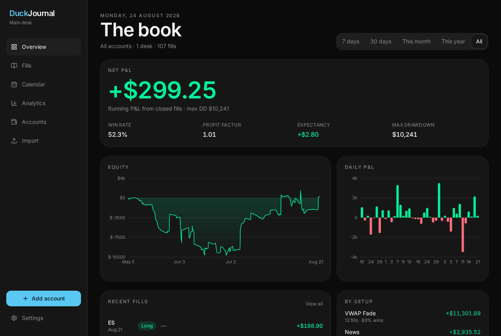

# DuckJournal

Local-first trading journal for Windows. One window, one SQLite file, no cloud database.

Connect MT4/MT5 desks, import broker reports, grade fills, and read combined P&L, calendar, and process stats.



## What it does

- **Overview** — combined P&L, equity, daily bars, recent fills across every account
- **Fills** — blotter with inspector: setup, process grade, emotions, notes, chart with entry / SL / TP
- **Calendar** — heatmap of the book
- **Analytics** — edge plus process (reviewed %, A/B rate, C–F leak, grade and emotion tables)
- **Accounts** — add desks (MT4 or MT5), sync, rename, remove
- **Import** — Generic CSV, MetaTrader 4, and MetaTrader 5 (`Save as Report` HTML or CSV)
- **Settings** — dark / light / system, playbook setups, CSV export of the book

Overview is always all accounts. Fills, calendar, and analytics can focus on one desk.

## Stack

| Layer | Tech |
|---|---|
| Desktop | [Tauri 2](https://tauri.app/) (Windows `.exe` + NSIS) |
| UI | React, TanStack Router, Tailwind CSS |
| Engine | Rust + SQLite (`crates/journal-core`) |
| Data | `%APPDATA%\com.duckjournal.desk\duckjournal.sqlite` |

No Postgres server. No DuckDB. Copy the `.sqlite` file to back up.

## Requirements (Windows)

- [Node.js 22+](https://nodejs.org/)
- [Rust](https://rustup.rs/) (stable)
- WebView2 (already on Windows 10/11)
- [Visual Studio Build Tools](https://visualstudio.microsoft.com/visual-cpp-build-tools/) with the **Desktop development with C++** workload

## Run

```bat
npm install
npm run desktop
```

Do **not** run `npx tauri` — that is a different npm package. Use `npm run desktop` or `npx @tauri-apps/cli`.

## Build the installer

```bat
npm run desktop:build
```

Output:

- `src-tauri\target\release\DuckJournal.exe`
- `src-tauri\target\release\bundle\nsis\` — installer

To update, build again and run the new installer over the old one. The journal file in AppData is left alone.

Full compile notes: [COMPILE.md](COMPILE.md).

## Use

1. **Accounts → Add account** — pick MT4 or MT5, then name, server, login, investor password.
2. MetaTrader should be **open and signed in** as that login. Investor password is read-only.
3. Click a fill to tag the setup, grade the process, and tick emotions. Sync keeps those fields.
4. **Import** for a real MT4/MT5 HTML report or CSV if you are not pulling from the terminal.
5. Deletes ask for confirm. Syncing an account again can restore a deleted fill; notes on it will not.

This build **simulates** the broker handshake so you can journal without a live MT bridge. Import is the path for real history today.

## Layout

```
src/                  React dashboard
crates/journal-core   SQLite journal engine
crates/journal-server Local HTTP API (browser / preview)
src-tauri/            Windows shell
```

## License

MIT
